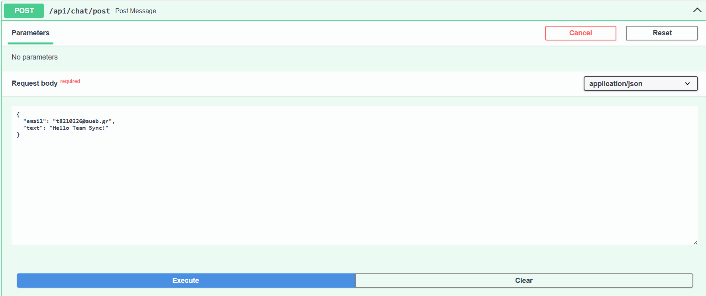

# StepIn Technical Guide

## Introduction

Welcome to StepIn! This comprehensive platform allows you to schedule, manage, and participate in physical meetings efficiently. This guide will walk you through the main features and functionalities of our application.

## Structure

### Backend

The [backend part of the app](/backend/) provides the logic regarding:

* Client communication ([`backend/app/api`](backend/app/api/))
* Database communication ([`backend/app/db`](backend/app/db/))
* Intermediate services that handle the integration between the controllers and the redis cache ([`backend/app/services`](backend/app/services/))

### Services

The most important part of the application rests in the [services folder](backend/app/services/). Its where all the logic of the application exists:

* `chat_service.py` handles operations regarding the chat messages (like post of a message).
* `meeting_service.py` handles meeting operations like creation, retrieval, user joining, user leaving etc.
* `user_service.py` handles user operations like creation/deletion and retrieval of users.
* `redis_service.py` handles all the redis operations, after each meeting becomes "active". Through `redis_service.py`, the application uses a redis cache to store meeting information for faster retrieval.

* Note: See [REDIS_SCHEMA.md](REDIS_SCHEMA.md) for a detailed description of the redis cache used.

### Endpoints

All the available features of the application (like meeting creation/retrieval, finding of nearby meetings etc) are exposed through <b>REST APIs</b> for easy usability. All the endpoints are placed in the [`backend/app/api/api_v1/endpoints`](backend/app/api/api_v1/endpoints/) folder. The endpoint functions use the service modules.

* Available endpoints:

<div align="center">
  
  <p><em>All the REST endpoints of the StepIn application</em></p>
</div>

* Example of GET user request:


<div align="center">
  
  <p><em>A GET request that has a response of the requested user</em></p>
</div>

In the example, we do a GET request to `api/users/pro.foibos@gmail.com` and we receive the following response:

```json
{
    "email": "pro.foibos@gmail.com",
    "name": "foivos",
    "age": 22,
    "gender": "male"
}
```

* Example of GET nearby meetings request:


1. Set the request parameters (user, lat and long of user
)
<div align="center">
  
  <p><em>A GET request that has a response of the requested nearby meetings</em></p>
</div>

2. Response:

<div align="center">
  
  <p><em>Response of GET nearby meetings request</em></p>
</div>


In the example, we do a GET request to `api/meetings/nearby?email=t8210226@aueb.gr&x=37.9929&y=23.7380` and we receive the following response:

```json
{
  "meetings": [
    2
  ]
}
```

Which are the ids of the meetings that the user `t8210226@aueb.gr` is invited in (participant) and are within 100 meters of his location (`x=37.9929, y=23.7380`)


* Example of POST message request:


1. Set the request parameters (user and test message)
<div align="center">
  
  <p><em>A POST request for a meeting message</em></p>
</div>

2. Response:

<div align="center">
  
  <p><em>Response of POST text message request</em></p>
</div>

We don't need to specify the meeting_id. The message gets sent to the meeting the user is joined in (user can join only one meeting at a time).

3. Result:

<div align="center">
  
  <p><em>Result of post message request</em></p>
</div>

You can test all the endpoints in `http://localhost:8000/docs` (make sure the application is running first).

All of these endpoints are used by the front end to create the graphical application the end-users can use.

Check out our demo of the graphical application [here](https://www.youtube.com/watch?v=I3OZZ0UwmI8).